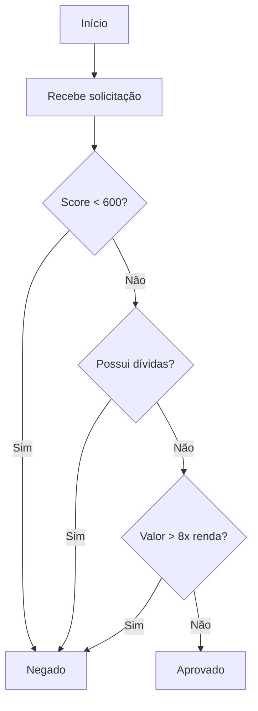

# Credit Decision API  
**Java 17 • Spring Boot 3 • REST API • H2 Database • Clean Architecture (Simplificada)**


API criada para realizar a análise simples de solicitações de crédito, aplicando regras objetivas baseadas em renda, score, valor solicitado e histórico de inadimplência. Projeto desenvolvido para fins de avaliação técnica.

---

## 📌 Objetivo do Projeto

Demonstrar domínio de:
- Java + Spring Boot  
- Estruturação de APIs REST  
- Boas práticas (Clean Architecture simplificada, DTOs, Services)  
- Persistência com JPA/H2  
- Testes unitários com JUnit/Mockito  
- Organização e clareza no código  

---

## 🏗 Arquitetura

A aplicação segue uma arquitetura em camadas para desacoplar as responsabilidades:

- **Controller:** Camada de entrada (REST), validação de DTOs e resposta HTTP.
- **Service:** Regras de negócio (lógica de aprovação de crédito).
- **Repository:** Interface de comunicação com o banco de dados.
- **Domain/Model:** Entidades do banco de dados.

### 🔹 Fluxo da Regra de Negócio



## 🚀 Como Rodar o Projeto

### Pré-requisitos
- **Java 17** ou superior
- **Maven 3.6+**

### Passo a passo
1. Clone o repositório:
   ```bash
   git clone https://github.com/seu-usuario/credit-decision-api.git
2. Entre na pasta do projeto:
    ```bash
    cd credit-decision-api
3. Compile e execute via Maven:
    ```bash
    mvn spring-boot:run
    A aplicação iniciará na porta 8080.

---

## 📡 Endpoints da API

### 1. Solicitar Análise de Crédito
**POST** `/api/credit/analyze`

Envia os dados do cliente para o motor de decisão.

**Corpo da Requisição (JSON):**
```json
{
  "customerName": "João da Silva",
  "cpf": "123.456.789-00",
  "income": 5000.00,
  "requestedAmount": 20000.00,
  "score": 750,
  "hasDebts": false
}
```

**Respostas Possíveis:**

- **✅ 200 OK (Aprovado):**
```json
{
  "status": "APPROVED",
  "message": "Crédito aprovado com sucesso."
}
```

- **❌ 200 OK (Negado):**
```json
{
  "status": "DENIED",
  "message": "Crédito negado. Motivo: Renda insuficiente para o valor solicitado."
}
```

---

## 🗄️ Acesso ao Banco de Dados (H2)

O banco de dados roda em memória e pode ser consultado via navegador.

- **URL do Console:** [http://localhost:8080/h2-console](http://localhost:8080/h2-console)
- **JDBC URL:** `jdbc:h2:mem:testdb`
- **User:** `sa`
- **Password:** *(deixe em branco)*

---

## ✅ Testes

Para executar os testes unitários e garantir que as regras de negócio estão funcionando:

```bash
mvn test
```

---

**Desenvolvido por [Natanael Silva]**
[LinkedIn](https://www.linkedin.com/in/natanael-silva-a91922204/) • [GitHub](https://github.com/NatanSilva31)
